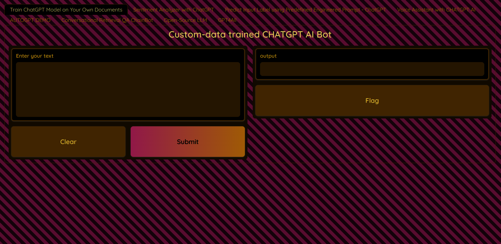
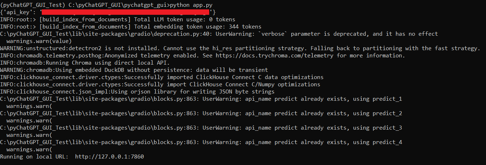
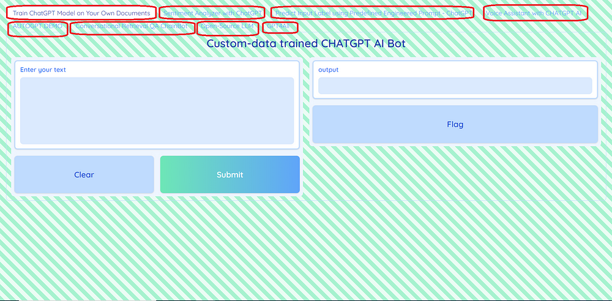

pyChatGPT GUI: An open-source, low-code python wrapper providing intuitive web GUI for quick and easy usage of the Large Language Models such as `ChatGPT`, `AutoGPT`, `LLaMa`, `GPT-J`, and `GPT4All` for custom-data and pre-trained inferences.
==========================================================================================================================

**pychatgpt_gui**

pypi: https://pypi.org/project/pychatgpt_gui

**Check the Related Blog** - https://ajay-arunachalam08.medium.com/
**Check the Related Blog** - https://ajay-arunachalam08.medium.com/

About pyChatGPT GUI
===================

`pyChatGPT_GUI` is a simple, ease-to-use Python GUI Wrapper built for unleashing the power of GPT. `pyChatGPT_GUI` provides an easy web interface to access the large language models (llm's) with several built-in application utilities for direct use. One can leverage ChatGPT, AutoGPT, LLaMa, GPT-J, and GPT4All models with pre-trained inferences and for your own data while democratizing the complex workflows. It provides a very `simple`, `easy-to-use` and `low-code` solution.    

`pyChatGPT_GUI` is concieved, designed and developed by `Ajay Arunachalam` - https://www.linkedin.com/in/ajay-ph-d-4744581a/

Please Note:- This work was just started, and by large still work in progress.

The application provides the following services (not limited too):-
===================================================================

- **Get `ChatGPT` inferences on your custom data**

- **Sentiment Analyzer with `ChatGPT`**

- **ChatGPT-based Voice Assistant Bot** 

- **Get `Auto-GPT` inferences for your requirement**

- **Conversational Retrieval Question & Answer (QA) Chain Bot**

- **Using open-source `GPT4` large language models based on `LLaMa` and `GPT-J`**

- **Get `GPT4All` models inferences**

- **Predict label of your inputted text from the predefined tags based on `ChatGPT`**

Who can try pychatgpt_ui?
=========================
`pyChatGPT_GUI` is an open-source package ideal for, but not limited too:-

- Researchers for quick Proof-Of-Concept (POC) prototyping and testing.
- Students and Teachers.
- ML/AI Enthusiasts, and Learners
- Citizen Data Scientists who prefer a low code solution for quick testing.
- Experienced Data Scientists who want to try out different use-cases as per their business context for quick prototyping.
- Data Science Professionals and Consultants involved in building Proof-Of-Concept (POC) projects.

Requirements
============

-  **Python 3.x.x**
-  numpy
-  pandas
-  scipy
-  tqdm
-  openai
-  gpt_index==0.4.24
-  PyPDF2
-  PyCryptodome
-  gradio
-  scikit-learn
-  openai_whisper
-  TTS
-  gTTS
-  ffmpeg
-  ffprobe
-  SpeechRecognition
-  pyaudio
-  playsound
-  langchain
-  chromadb
-  tiktoken
-  pypdf
-  unstructured[local-inference]
-  nomic
-  pyllamacpp
-  pygpt4all
-  warnings

Usage Steps
===========
Step 1) Create a virtual environment

.. code:: bash
	
	py -3 -m venv <your_env_name>
	cd <your_env_name>/Scripts/activate
	
	**or**
	
	conda create -n <your_env_name> python=3.x (or 3.x)
	source activate <your_env_name>

Step 2) Create the clone of the repository in your created virtual environment

.. code:: bash

    $ git clone https://github.com/ajayarunachalam/pychatgpt_gui
    $ cd pychatgpt_gui
	$ sudo bash setup.sh

    **or**

.. code:: bash

    $ git clone https://github.com/ajayarunachalam/pychatgpt_gui
    $ cd pychatgpt_gui
    $ sudo bash setup.sh or python setup.py install
	
	**or**
	
.. code:: bash
	>>> git clone https://github.com/ajayarunachalam/pychatgpt_gui
	>>> cd pychatgpt_gui
	>>> pip install -r requirements.txt
	
Step 3) Setup the environment configuration for using OpenAI through API. Enter your OpenAI api key in the "api_key.json" file. Note:- Please replace the null string with your key. Check this link on how to get an OpenAI API key - https://www.howtogeek.com/885918/how-to-get-an-openai-api-key/

Step 4) Download the GPT4All model from http://gpt4all.io/models/ggml-gpt4all-l13b-snoozy.bin and place it under the models/ folder. Alternatively, you can also use GPT4All-J model which can be downloaded from here - https://gpt4all.io/models/ggml-gpt4all-j-v1.3-groovy.bin and similarly place it under the models/ folder in the root directory. 

Step 5) Add your own set of documents to train the chatGPT AI bot under the docs/ folder. You could use multiple text files, Scanned files, PDF files, etc. Note:- If you have a large table in Excel, you can import it as a CSV or PDF file and then add it to the "docs" folder. 

Step 6) Add your own custom documents to train the Q&A chatbot with Conversational Retrieval Chain under the qa_docs/ folder. You can use any of the following file types: text files, pdf files, docx files, and log files

Step 7) Launch the APP

- **Linux users navigate within the cloned folder and type in "sudo bash run_app_linux.sh" in the terminal**

- **Windows users within the cloned folder just simply double-click the "run_app_windows.bat" file. Note:- Open the file with an Editor and replace with your virtual directory path within the file**

The APP will launch with a URL as seen below.

APP MAIN WINDOW
===============

License
=======
Copyright 2022-2023 Ajay Arunachalam <ajay.arunachalam08@gmail.com>

Permission is hereby granted, free of charge, to any person obtaining a copy of this software and associated documentation files (the "Software"), to deal in the Software without restriction, including without limitation the rights to use, copy, modify, merge, publish, distribute, sublicense, and/or sell copies of the Software, and to permit persons to whom the Software is furnished to do so, subject to the following conditions:

The above copyright notice and this permission notice shall be included in all copies or substantial portions of the Software.

THE SOFTWARE IS PROVIDED "AS IS", WITHOUT WARRANTY OF ANY KIND, EXPRESS OR IMPLIED, INCLUDING BUT NOT LIMITED TO THE WARRANTIES OF MERCHANTABILITY, FITNESS FOR A PARTICULAR PURPOSE AND NONINFRINGEMENT. IN NO EVENT SHALL THE AUTHORS OR COPYRIGHT HOLDERS BE LIABLE FOR ANY CLAIM, DAMAGES OR OTHER LIABILITY, WHETHER IN AN ACTION OF CONTRACT, TORT OR OTHERWISE, ARISING FROM, OUT OF OR IN CONNECTION WITH THE SOFTWARE OR THE USE OR OTHER DEALINGS IN THE SOFTWARE. © 2023 GitHub, Inc.

References
==========
I take this opportunity to acknowledge and thanks the `openai`, `huggingface`, `langchain`, `gpt4all`, `pygpt4all` communities. 
Also, my special mention to - `Ali Abid` and `Timothy Mugayi`.
